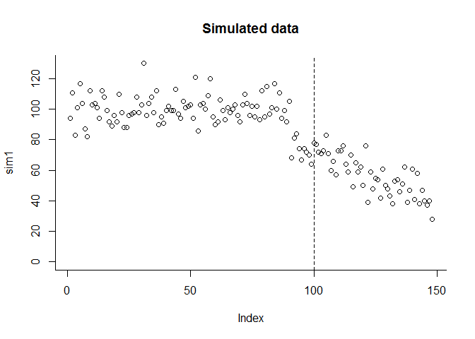
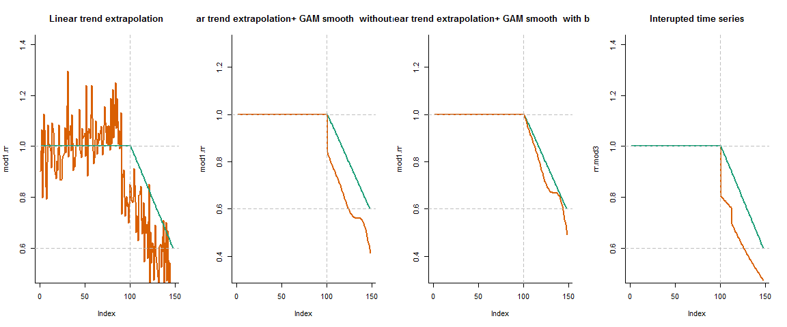

Bias adjustment
================
Dan Weinberger
September 12, 2018

-   [Evaluation of bias adjustment vs other approach](#evaluation-of-bias-adjustment-vs-other-approach)
    -   [Method 1: fit trend to pre period; extrapolate trend, and calculate pointwise RR](#method-1-fit-trend-to-pre-period-extrapolate-trend-and-calculate-pointwise-rr)
    -   [METHOD 2: bias correction approach in 2 stages](#method-2-bias-correction-approach-in-2-stages)
-   [METHOD 3: ITS](#method-3-its)
    -   [These plots show the True RR (blue) and the Estimated RR (orange).](#these-plots-show-the-true-rr-blue-and-the-estimated-rr-orange.)

Evaluation of bias adjustment vs other approach
===============================================

In this set of simulations, I generate a dataset where the mean number of cases drops prior to vaccine introduction, and then the vaccine effect kicks in. I test a simple trend adjustment model, a 2 stage approach in which we first do simple trend adjustment, then fit a GAM spline to smooth the RR estimates, with or without bias adjustment. And third, a standard Interrupted time series model (change in mean and trend, with a 12 month ramp up period)

Simulate data from a Poisson model. Mean is **100 for first 90 months**, then **70 for 10 months**, then vaccine introduced, and **decline 30%** over remaining months

``` r
set.seed(123)
post.eff.rr=seq.int(from=1, to=0.6, length.out=48 )
sim1<- c(rpois(n=90, lambda=100), rpois(n=10, lambda=70), rpois(n=48, lambda=70*post.eff.rr))
plot(sim1, ylim=c(0,max(sim1)), bty='l', bty='l')
abline(v=100, lty=2)
title('Simulated data')
```



Method 1: fit trend to pre period; extrapolate trend, and calculate pointwise RR
--------------------------------------------------------------------------------

``` r
sim1.pre<-sim1
sim1.pre[101:length(sim1)]<-NA
time<-1:length(sim1)
ds1<-cbind.data.frame(sim1.pre,sim1, time)
mod1<-glm(sim1.pre~time, family='poisson', data=ds1)
mod1.pred<-exp(predict(mod1, newdata=ds1))
mod1.rr<-sim1/mod1.pred
```

METHOD 2: bias correction approach in 2 stages
----------------------------------------------

Take stage 1 estimate, fit spline through it

``` r
library(mgcv)
```

    ## Warning: package 'mgcv' was built under R version 3.5.1

    ## Loading required package: nlme

    ## This is mgcv 1.8-24. For overview type 'help("mgcv-package")'.

``` r
mod1.rr.post<-mod1.rr[100:length(sim1)] #include last pre-vax time point
ds2<-cbind.data.frame(log(mod1.rr.post), (1:length(mod1.rr.post)-1))
names(ds2)<-c('log.rr','time')
mod2<-gam( log.rr~s(time), data=ds2)
pred.mod2<-exp(predict(mod2))
intercept.mod2<- log(pred.mod2[1])
pred.mod2.unbias<-exp(predict(mod2) - intercept.mod2 )
```

METHOD 3: ITS
=============

``` r
post.period<-rep(0, length(sim1))
post.period[101:112]<-1
post.period[113:length(sim1)]<-2
post.period<-as.factor(post.period)
time.all<-1:length(sim1)
ds3<-cbind.data.frame(sim1, post.period, time.all)
mod3<-glm(sim1~ post.period*time.all, family='poisson')
mod3.fit<-exp(predict(mod3, newdata=ds3))
coef.mod3<-coef(mod3)
counter.fact<- exp(coef.mod3['(Intercept)'] + time.all*coef.mod3['time.all'] )
rr.mod3<- mod3.fit/ counter.fact
```

These plots show the True RR (blue) and the Estimated RR (orange).
------------------------------------------------------------------


